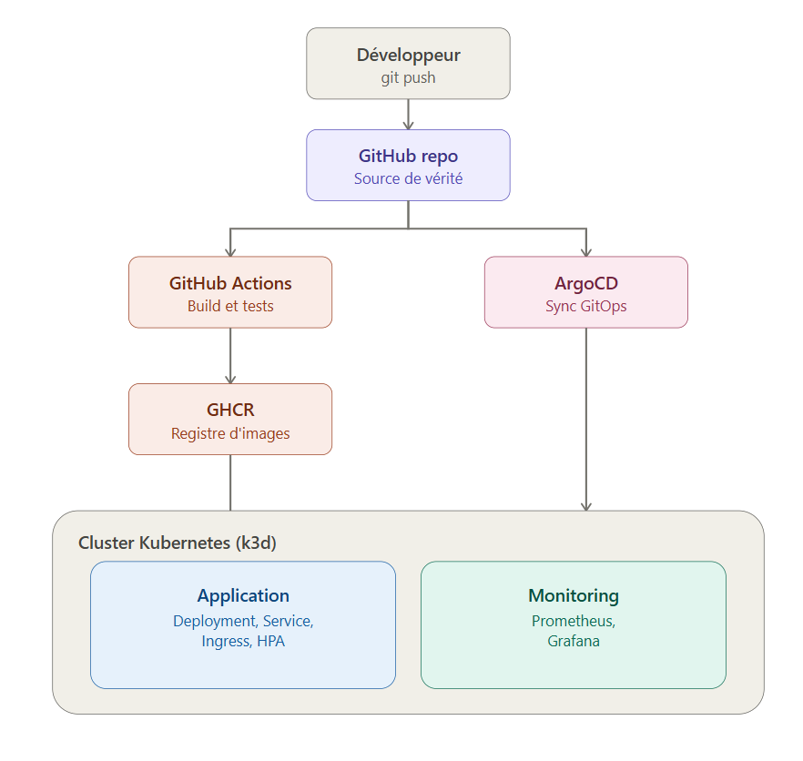
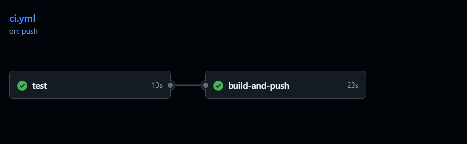
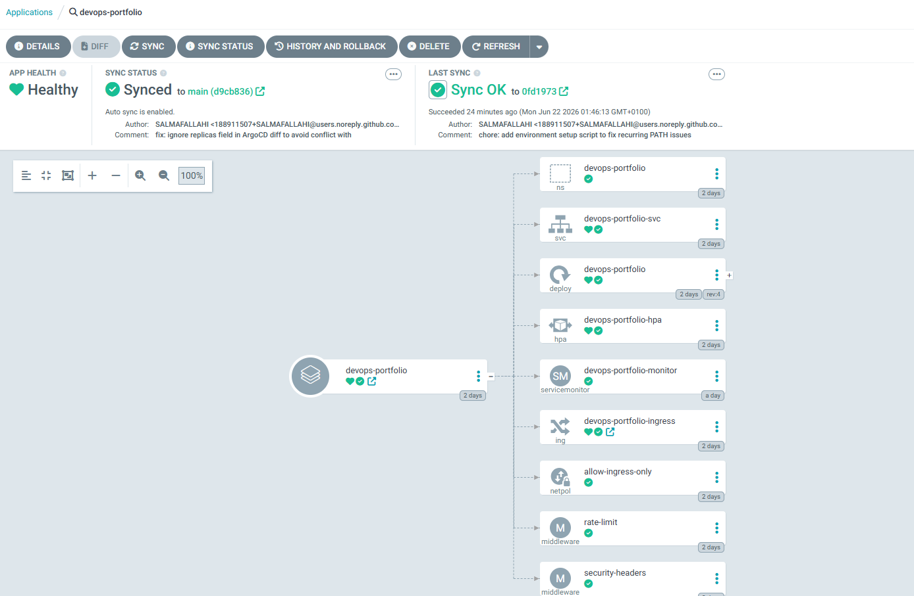
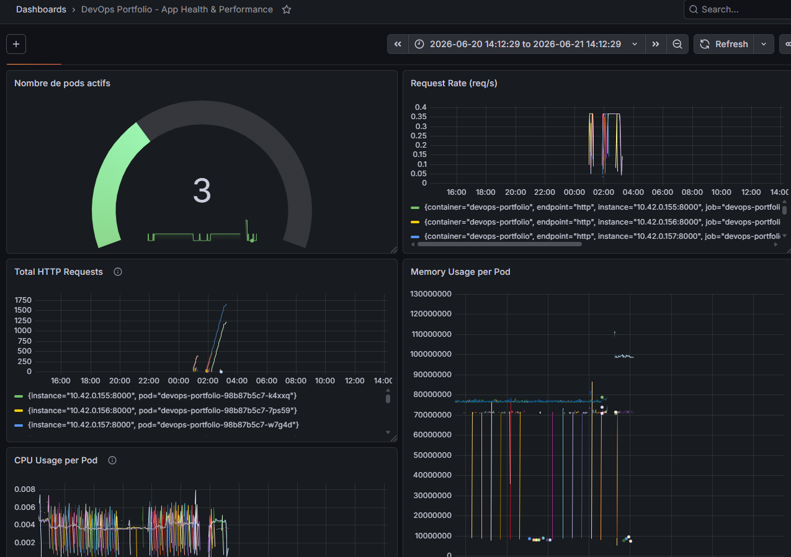
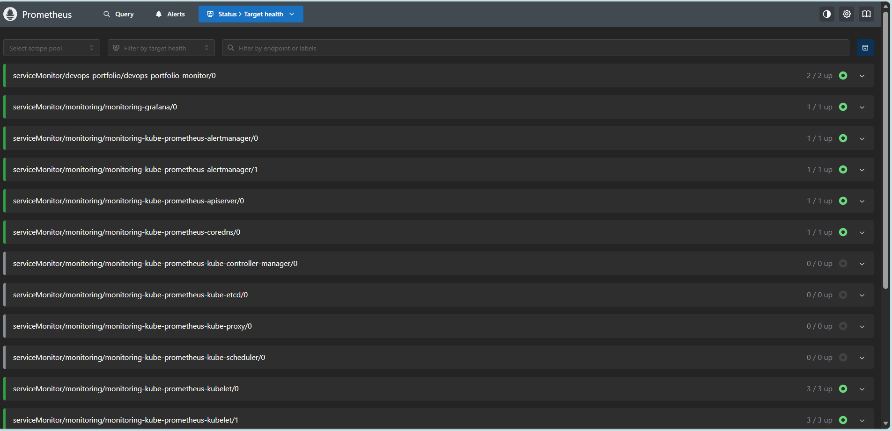

# DevOps Portfolio – Infrastructure Kubernetes complète


Infrastructure DevOps complète et 100% open source : une API FastAPI conteneurisée, déployée sur un cluster Kubernetes local (k3d), avec CI/CD automatisé, déploiement GitOps via ArgoCD, et observabilité complète (Prometheus + Grafana).

Projet personnel construit pour appliquer en conditions réelles les pratiques DevOps modernes : Infrastructure as Code, GitOps, sécurité réseau, autoscaling et monitoring applicatif.

---

## Architecture



Le flux complet :
1. Le code est poussé sur GitHub
2. **GitHub Actions** lance les tests, build l'image Docker et la publie sur **GitHub Container Registry (ghcr.io)**
3. **ArgoCD** surveille en continu le dossier `kubernetes/` du repo et synchronise automatiquement l'état du cluster (GitOps)
4. L'application tourne dans un cluster **k3d** (1 control-plane + 2 workers), avec autoscaling, isolation réseau et observabilité complète

---

## Stack technique

| Catégorie | Outils |
|---|---|
| Application | Python, FastAPI, pytest |
| Conteneurisation | Docker (multi-stage build, non-root) |
| Orchestration | Kubernetes (k3s/k3d) |
| Infrastructure as Code | Manifests Kubernetes déclaratifs |
| CI/CD | GitHub Actions, GitHub Container Registry |
| GitOps | ArgoCD |
| Réseau & sécurité | Ingress (Traefik), NetworkPolicy, rate limiting, security headers |
| Scalabilité | Horizontal Pod Autoscaler (HPA) |
| Observabilité | Prometheus, Grafana, kube-prometheus-stack |

---

## Fonctionnalités démontrées

- Cluster Kubernetes multi-node avec séparation control-plane / workers (taint appliqué)
- Pipeline CI/CD complet : tests automatisés → build Docker → publication sur registre
- Déploiement GitOps automatique (zéro `kubectl apply` manuel en usage courant)
- Autoscaling basé sur la charge CPU réelle (HPA)
- Isolation réseau entre namespaces (NetworkPolicy) avec exceptions explicites et justifiées
- Sécurité applicative : rate limiting, headers de sécurité (CSP, X-Frame-Options, etc.)
- Monitoring applicatif réel : métriques custom exposées par l'app, scrapées par Prometheus, visualisées dans un dashboard Grafana dédié

---

## Captures d'écran

### Pipeline CI/CD (GitHub Actions)


### ArgoCD – synchronisation GitOps


### Dashboard Grafana – métriques applicatives


### Prometheus – Targets


---

## Structure du repo

```
devops-portfolio/
├── app/                      # Code source de l'API FastAPI
│   ├── main.py
│   ├── requirements.txt
│   └── tests/
├── kubernetes/                # Manifests Kubernetes (gérés par ArgoCD)
│   ├── namespace.yaml
│   ├── deployment.yaml
│   ├── service.yaml
│   ├── ingress.yaml
│   ├── hpa.yaml
│   ├── networkpolicy.yaml
│   ├── servicemonitor.yaml
│   ├── middleware-ratelimit.yaml
│   └── middleware-headers.yaml
├── argocd/
│   └── application.yaml       # Définition de l'Application ArgoCD
├── cluster/
│   └── k3d-config.yaml        # Config déclarative du cluster k3d
├── scripts/
│   └── setup-env.ps1          # Script d'initialisation d'environnement (Windows)
├── .github/workflows/
│   └── ci.yml                 # Pipeline CI/CD
├── Dockerfile
├── Makefile
└── README.md
```

---

## Lancer le projet en local

### Prérequis
- Docker Desktop
- kubectl
- k3d
- helm
- make (optionnel, sinon utiliser les commandes équivalentes ci-dessous)

### Démarrage

```bash
# 1. Cloner le repo
git clone https://github.com/SALMAFALLAHI/devops-portfolio.git
cd devops-portfolio

# 2. Créer le cluster k3d
k3d cluster create --config cluster/k3d-config.yaml

# 3. Build et importer l'image de l'application
docker build -t devops-portfolio:dev .
k3d image import devops-portfolio:dev -c devops-cluster

# 4. Installer ArgoCD
kubectl create namespace argocd
kubectl apply -n argocd -f https://raw.githubusercontent.com/argoproj/argo-cd/stable/manifests/install.yaml --server-side

# 5. Déployer l'application via ArgoCD
kubectl apply -f argocd/application.yaml

# 6. Installer la stack monitoring
kubectl create namespace monitoring
helm repo add prometheus-community https://prometheus-community.github.io/helm-charts
helm install monitoring prometheus-community/kube-prometheus-stack --namespace monitoring --set grafana.adminPassword=admin123
```

### Accès aux interfaces

```bash
# Application (via Ingress)
curl http://localhost:8080/health

# ArgoCD UI
kubectl port-forward svc/argocd-server -n argocd 8081:443
# → https://localhost:8081 (admin / récupérer le mot de passe via kubectl get secret)

# Grafana
kubectl port-forward -n monitoring svc/monitoring-grafana 3000:80
# → http://localhost:3000 (admin / admin123)

# Prometheus
kubectl port-forward -n monitoring svc/monitoring-kube-prometheus-prometheus 9090:9090
# → http://localhost:9090
```

---

## Défis techniques rencontrés et solutions

Cette section documente des problèmes réels rencontrés pendant la construction du projet — pas juste un tutoriel suivi sans réflexion.

**Conflit entre ArgoCD et le HPA sur le champ `replicas`**
Avec `selfHeal: true` activé, ArgoCD tentait de remettre le nombre de replicas à la valeur définie dans Git, entrant en conflit avec les décisions dynamiques du HPA. Résolu en ajoutant `ignoreDifferences` sur `/spec/replicas` dans l'Application ArgoCD — laissant le HPA gérer ce champ exclusivement.

**NetworkPolicy bloquant Prometheus**
Après avoir restreint l'accès réseau à l'application au seul namespace `kube-system` (pour l'Ingress), Prometheus (dans le namespace `monitoring`) ne pouvait plus scraper les métriques applicatives. Résolu en ajoutant une règle d'autorisation explicite pour le namespace `monitoring`.

**ServiceMonitor non détecté par Prometheus**
Le `ServiceMonitor` ciblait les labels du Service, pas son `selector` de pods — un Service sans `metadata.labels` reste invisible pour Prometheus Operator même si la configuration semble correcte.

**Tags Docker invalides sur GHCR**
Les noms de repository GHCR doivent être en minuscules ; un username GitHub avec majuscules casse le build-and-push si non normalisé explicitement dans le workflow CI.

---

## Roadmap / améliorations possibles

- [ ] Ajout de Loki pour la centralisation des logs
- [ ] Déploiement sur un VPS cloud (Oracle Cloud Free Tier) pour une URL publique
- [ ] TLS/HTTPS via cert-manager + Let's Encrypt
- [ ] Tests d'intégration end-to-end automatisés en CI

---

## Auteur

**Salma Fallahi** — Étudiante en IT Architecture & Cloud à ESPRIT
